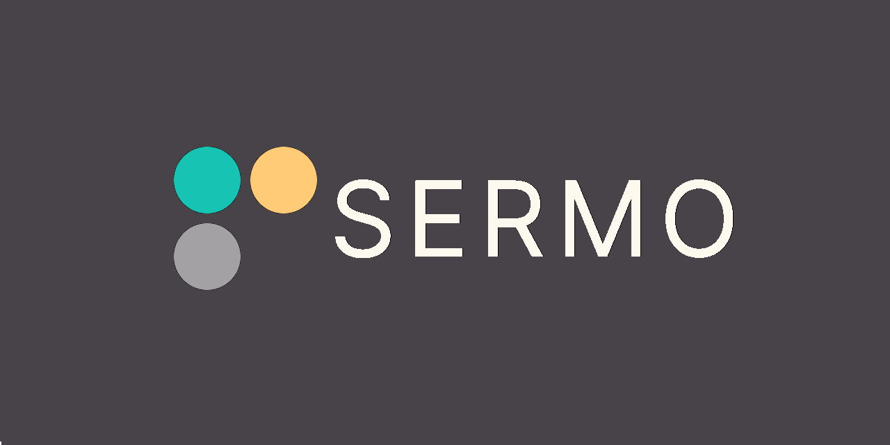

# 

Senha &amp; Termo!

Uma versão que mistura Termo com Senha, onde o jogador não vê quais letras estão corretas, apenas as quantidades de acertos.

[Clique aqui para acessar o beta em produção](https://sermo-beta.vercel.app)


---

## 🧠 Conceito

Diferente do Termo tradicional, aqui o jogador recebe apenas:

- 🟢 Quantidade de letras na posição correta  
- 🟡 Quantidade de letras presentes em posição errada  
- 🔴 Quantidade de letras ausentes  

Isso transforma o jogo em um desafio mais lógico e dedutivo.

---

## 🚀 Stack

- ⚡ Vite
- ⚛ React
- 🟦 TypeScript
- 🍞 Bun
- 💾 LocalStorage (persistência diária)
- 🎨 TailwindCSS

---

## 📅 Sistema Diário

A palavra é determinística por data

O progresso é salvo no localStorage

Não é possível jogar novamente no mesmo dia

Um novo jogo começa automaticamente no dia seguinte

---

## 🎮 Como Rodar

#### Instalar dependencias
```bash
bun install
```

#### Rodar em desenvolvimento
```bash
bun run dev
```

#### Build
```bash
bun run build
```

--- 

## 📋 Testes

#### O projeto utiliza:
- Vitest

#### Para rodar:

```bash
bunx vitest
```

## 💚 Obrigado

